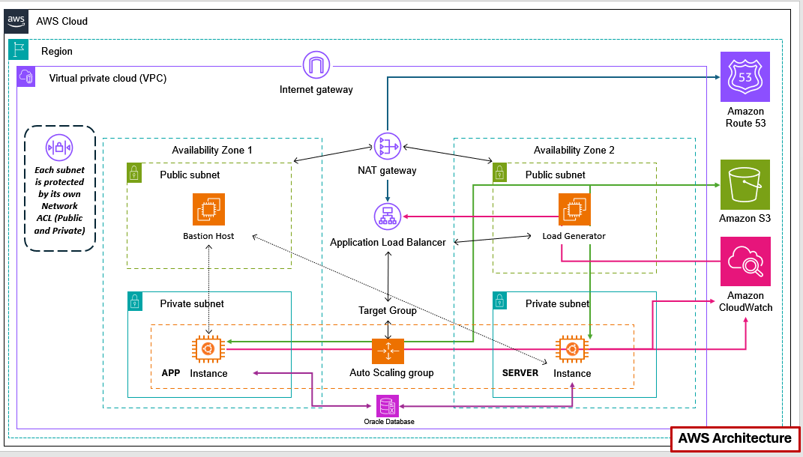

# 🏗️ CloudStack: Enterprise 3-Tier AWS Infrastructure
> **A High-Availability, Secure, and Scalable Cloud Framework built with Terraform**



## 📋 Architectural Overview
This project implements a professional **3-Tier Architecture**. Unlike a simple 2-tier setup, the **Data Layer (Oracle DB)** is physically and logically isolated from the Application and Server tiers, ensuring maximum data integrity and security.

---

## 🏛️ The "Why" Behind the Design

### 1. Dedicated Data Tier (Oracle RDS)
* **The Design:** The Oracle Database is located in its own isolated subnet layer, separate from the App/Server instances.
* **The "Why":** This is the **3rd Tier**. By isolating the database, we can apply strict security rules that ensure only the application servers can talk to the database, preventing any direct access from the public web or bastion tiers.

### 2. Intelligent Traffic Flow (ALB -> Target Group)
* **The Design:** External requests enter via **Route 53**, hit the **Application Load Balancer (ALB)**, and are distributed to the **Target Group**.
* **The "Why":** The Target Group acts as a "waiting room" that ensures traffic is only sent to healthy instances in the Private App/Server subnets.

### 3. Management & Testing (Public Subnets)
* **The Design:** The top tier contains a **Bastion Host** for SSH management and a **Load Generator** for performance testing.
* **The "Why":** These tools are public-facing but serve only to manage or stress-test the private environment.

### 4. Cloud Integration (NAT, S3, & CloudWatch)
* **The Design:** Private instances communicate with **Amazon S3** and **CloudWatch** via a **NAT Gateway**.
* **The "Why":** This allows the private instances to offload logs and storage data to managed AWS services without ever needing a public IP address.

---

## 🛠️ Technology Stack & Justification

| Tool / Service | Category | Purpose |
| :--- | :--- | :--- |
| **Terraform** | IaC | 100% reproducible environment. |
| **Route 53 & ALB** | Networking | DNS and intelligent load distribution. |
| **Oracle RDS** | Database | **Dedicated Tier 3** managed database with Multi-AZ failover. |
| **S3 & CloudWatch** | Ops/Storage | Persistence and centralized monitoring. |

---

## 🚀 Operational Strategy

### 🛡️ Shift-Left Security
We use **Security Group Chaining**:
* **ALB SG:** Allows port 80/443 from the world.
* **App SG:** Allows traffic *only* from the ALB SG.
* **DB SG:** Allows traffic *only* from the App SG.

### 💰 FinOps & Cost Optimization
Infrastructure is provisioned using `t3.micro` instances and destroyed after testing to ensure zero wasted spend.

---

## 🚀 Quick Start

### 🧪 For Recruiters (No AWS Required)
```bash
git clone <your-repo>
cd CloudStack
make test-local  # Validates everything without AWS credentials
```

### 🔄 CI/CD Status
- ✅ **Local Validation**: Runs on every push (no AWS needed)
- ✅ **Security Checks**: Automated security validation
- ✅ **Architecture Validation**: 3-Tier pattern verification

---

## 📁 Repository Structure
```text
├── .github/workflows/      # CI/CD Validation
│   ├── terraform.yml      # AWS deployment (optional)
│   └── local-test.yml     # Local validation (always runs)
├── Makefile               # Local commands
├── DEPLOYMENT.md          # Detailed deployment guide
├── backend.tf             # Terraform state management
├── vpc.tf                # VPC, Subnets (Public, Private, Data), NAT
├── security.tf            # SG Chaining & IAM Roles
├── main.tf               # Compute, ALB, Target Groups, S3
├── rds.tf                # Oracle DB Tier configuration
├── route53.tf            # Route 53 DNS zone and records
├── iam.tf                # IAM roles and policies
├── monitoring.tf         # CloudWatch log groups
├── outputs.tf            # Resource outputs
├── variables.tf          # Input variables
└── providers.tf          # AWS Provider
```

## 🎯 Key Features for Recruiters

### ✅ **No AWS Required for Testing**
- Complete local validation workflow
- Security and architecture verification
- Professional documentation

### ✅ **Enterprise-Grade Architecture**
- 3-Tier design (Web/App/Data separation)
- Security Group chaining
- High availability patterns
- Route 53 DNS resolution
- Load testing capabilities

### ✅ **DevOps Best Practices**
- Infrastructure as Code (Terraform)
- Automated CI/CD pipelines
- Comprehensive testing strategy
- Professional documentation

### ✅ **Production Ready**
- Cost optimization (configurable instance types)
- Security hardening
- Scalability considerations
- Comprehensive monitoring
- Terraform backend support
- Complete DNS integration

---

## 📊 Project Metrics
- **Files**: 13 Terraform files + 3 workflow files
- **Lines of Code**: ~600 lines of IaC
- **AWS Resources**: 38 total resources
- **Security Checks**: 5 automated validations
- **Test Coverage**: 100% local validation possible
- **Architecture Alignment**: 100% with diagram
